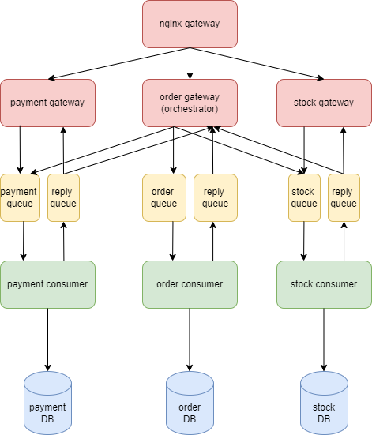

## Project:
This project contains a set of microservices that need to coordinate in order to guarantee data consistency. We have used reactive microservices pattern using multithreading and RabbitMQ for loosely coupled and single responsibility principles. When a message is received by the system, it is received by one of the three gateways (order, payment, or stock gateway) which publish the message to the order, payment, and stock queue respectively. These messages are consumed by the relevant consumer and updates are made to the database. An appropriate response is published to the reply queue which is consumed by the gateway. 

For fault tolerance and eventual consistency, the following has been implemented:
- In case of DB failure, a retry and timeout mechanism has been implemented.
- Queues are used to handle service failures as the message will remain in the queues.
- To handle data consistency, message IDs are used as identifiers to avoid duplicate DB updates.

Replicas can be added in the docker compose file to easily scale the architecture.

The Checkout feature is implemented using orchestration-based saga pattern. In an orchestration saga, an orchestrator object tells the participants what local transactions to execute. In this project, this object is present in the Order service.

## Pre-requisites:
- Docker
- Python

## Running:
- Clone the repository using git clone command
- Run the project using docker compose up --build

## Warnings: 
- Shutting down RabbitMQ will lead to failure of the system.
- Shutting down gateways will lead to Bad Gateway error.